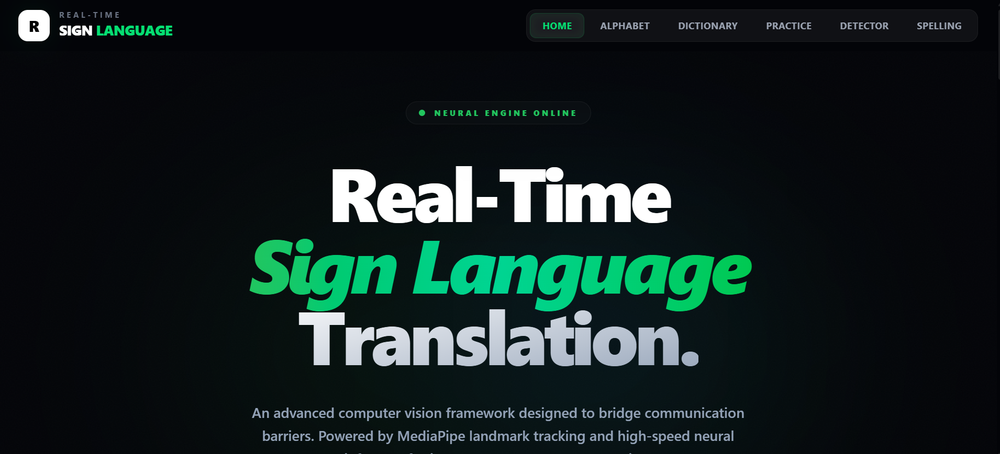
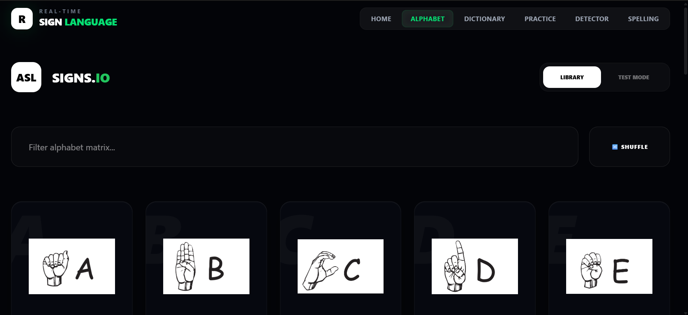
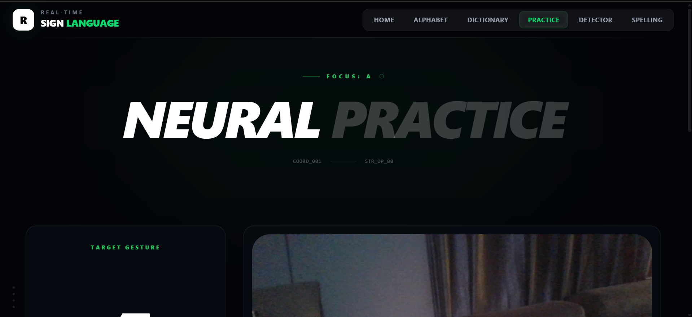
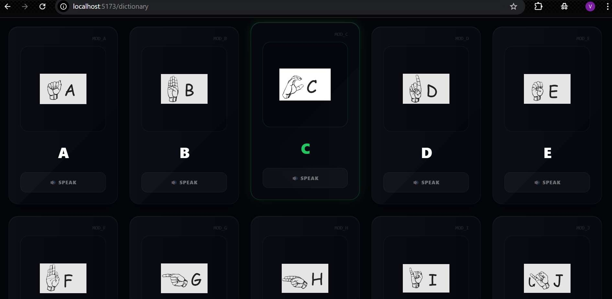

<h1 align="center">🚀 Real-Time ASL Sign Language Detection System</h1>

🚀 Real-time AI-powered gesture recognition  
🧠 Built with TensorFlow, FastAPI, and React  
⚡ Converts sign language into text and speech instantly  

An AI-powered system that uses computer vision and deep learning to recognize American Sign Language (ASL) gestures in real time and convert them into text and speech.

💡 Designed as a real-world AI application for assistive communication and human-computer interaction.


---

## 🔥 Live Demo

🚧 Live demo coming soon (deployment in progress)

---

## 🧠 Overview

This project demonstrates a **full-stack AI system** integrating:

- Computer Vision (MediaPipe, OpenCV)
- Deep Learning (TensorFlow CNN)
- Backend APIs (FastAPI)
- Frontend UI (React + Vite)

It enables real-time interaction between humans and machines using **gesture-based communication**.

---

## ⭐ Project Highlights

- Real-time gesture recognition system
- Real-time webcam-based gesture detection
- Full-stack AI application
- Production-ready architecture
- Modular and scalable design

---

## 🔍 Keywords

Sign Language Detection • ASL Recognition • Gesture Recognition • Computer Vision Project • Deep Learning Application • Real-Time AI System • TensorFlow CNN • FastAPI Backend • React Frontend

---

## 🚀 Features

### 🔤 Alphabet Trainer

Interactive module to learn ASL alphabet gestures visually.

- Displays A–Z sign gestures
- Click any letter to start practicing
- Beginner-friendly learning interface

---

### 🎥 Gesture Practice (AI Recognition)

Real-time AI-based gesture recognition using webcam input.

Workflow:

1. Open camera  
2. Perform sign gesture  
3. AI detects the gesture  
4. System verifies correctness  

Output includes:

- Detected letter  
- Confidence score  
- Correct / Incorrect feedback  

---

### 📖 Sign Language Dictionary

Search and explore sign gestures.

- Instant letter search  
- Sign image display  
- Gesture description  
- Audio pronunciation  

---

### 🔊 Text-To-Speech

Converts detected gestures into real-time spoken audio using Google Text-To-Speech (gTTS).

---

## 🧠 AI Detection Pipeline

```text
Webcam Frame
      ↓
MediaPipe Hand Detection
      ↓
Hand Cropping
      ↓
Image Resize (64×64)
      ↓
CNN Model Prediction
      ↓
Prediction Stabilization
      ↓
Output Letter + Confidence
```

---

## 🏗 System Architecture

```text
React Frontend
      │
      │ HTTP API
      ▼
FastAPI Backend
      │
      ▼
TensorFlow CNN Model
      │
      ▼
Prediction Result
      │
      ▼
Text → Speech Output
```

---

## 📊 Model Performance

- Model Type: CNN (TensorFlow/Keras)
- Framework: TensorFlow / Keras
- Classes: 26 (A–Z)
- Input Size: 64x64
- Accuracy: ~95% (approximate during testing)
- Dataset: Custom ASL dataset

---

## ⚡ Challenges & Solutions

### 1. Prediction Flickering
- **Problem:** Unstable outputs frame-by-frame  
- **Solution:** Frame averaging (prediction smoothing)  

### 2. Lighting Variations
- **Problem:** Reduced accuracy in different environments  
- **Solution:** Data augmentation  

### 3. Real-time Latency
- **Problem:** Delay in inference  
- **Solution:** Image resizing and optimized pipeline  

### 4. Model Generalization
- **Problem:** Model struggled with unseen hand variations  
- **Solution:** Improved dataset diversity and augmentation  

---

## 🧪 Real-World Engineering Value

This project demonstrates:

- Integration of AI models into production systems  
- Real-time data processing and inference  
- Scalable backend architecture using FastAPI  
- Frontend interaction with live AI predictions  
- Deployment-ready architecture for real-world applications  

---

## 💼 Use Cases

- Assistive communication system for hearing and speech-impaired individuals  
- Educational ASL learning platform  
- Gesture-based human-computer interaction  

---

## 🛠 Tech Stack

### Frontend
- React  
- Vite  
- TailwindCSS  
- React Router  
- Axios  

### Backend
- Python  
- FastAPI  
- Uvicorn  

### AI / Computer Vision
- TensorFlow  
- Keras  
- OpenCV  
- MediaPipe  
- NumPy  

### Audio
- gTTS (Google Text-To-Speech)  

---

## 📂 Project Structure

```text
sign-language-translator
│
├── ai-training
│   ├── dataset
│   └── train_model.py
│
├── backend
│   ├── requirements.txt
│   ├── run.py
│   │
│   ├── app
│   │   ├── main.py
│   │   │
│   │   ├── api
│   │   │   └── routes.py
│   │   │
│   │   ├── services
│   │   │   ├── gesture_detection.py
│   │   │   ├── sentence_builder.py
│   │   │   ├── translator.py
│   │   │   └── tts_service.py
│   │   │
│   │   ├── core
│   │   │   └── model_loader.py
│   │   │
│   │   └── models
│   │       └── asl_model.h5
│   │
│   └── static
│
├── frontend
│   ├── package.json
│   ├── vite.config.js
│   │
│   ├── public
│   │   └── signs
│   │       ├── A.png
│   │       ├── B.png
│   │       └── ...
│   │
│   └── src
│       ├── components
│       │   ├── camera
│       │   │   ├── CameraFeed.tsx
│       │   │   └── GestureStatus.tsx
│       │   │
│       │   └── ui
│       │   │   ├── Button.jsx
│       │   │   ├── Card.jsx
│       │   │   └── Section.jsx
│       │   │
│       │   ├── Footer.jsx
│       │   └── Navbar.jsx
│       │
│       ├── layout
│       │   └── AppLayout.jsx
│       │
│       ├── pages
│       │   ├── Alphabet.jsx
│       │   ├── Detector.jsx
│       │   ├── Dictionary.jsx
│       │   ├── Home.jsx
│       │   ├── Practice.jsx
│       │   └── Spelling.jsx
│       │
│       ├── sections
│       │   ├── CallToAction.jsx
│       │   ├── Features.jsx
│       │   ├── Hero.jsx
│       │   └── HowItWorks.jsx
│       │
│       ├── services
│       │   └── api.ts
│       │
│       ├── App.jsx
│       ├── main.jsx
│       └── index.css
│
├── images
│   ├── alphabet.png
│   ├── practice.png
│   └── dictionary.png
│
├── README.md
└── .gitignore
```

---

---

## ⚙️ Installation

### 1️⃣ Clone Repository

```bash
git clone https://github.com/vipulsystems/real-time-asl-sign-language-detection.git
cd real-time-asl-sign-language-detection
```

---

### 🖥 Backend Setup

```bash
cd backend
python -m venv venv
```

Activate virtual environment:

```bash
venv\Scripts\activate   # Windows
source venv/bin/activate   # Linux / Mac
```

Install dependencies:

```bash
pip install -r requirements.txt
```

Run backend server:

```bash
python run.py
```

Backend will run at:
http://localhost:8000

---

### 🌐 Frontend Setup

> ⚠️ Ensure backend is running before starting frontend

```bash
cd frontend
npm install
npm run dev
```

Frontend will run at:
http://localhost:5173

---

## 🧪 Usage

1. Open the application in your browser
2. Navigate to the **Alphabet Trainer**
3. Select a letter to practice
4. Perform the gesture using your webcam
5. View real-time prediction and feedback
6. Use the dictionary for reference and learning

---

## 📸 Screenshots

### Home Page



### Alphabet Trainer



### Gesture Practice



### Dictionary



---

## 🔮 Future Improvements

* Real-time continuous gesture detection
* Word-level sign recognition
* Sentence translation
* Mobile device support
* Transformer-based gesture models
* Large-scale sign language datasets

---

## 🤝 Contributing

Contributions are welcome.

1. Fork the repository
2. Create a new branch (`feature/your-feature`)
3. Commit your changes
4. Push to your branch
5. Open a Pull Request

---

## 📜 License

MIT License

---

## 👨‍💻 Author

**Vipul Paighan**  
Full Stack Developer | AI & Computer Vision Engineer  

### 🔧 Core Expertise
- Backend: Spring Boot, FastAPI, REST APIs  
- Frontend: React.js, Tailwind CSS  
- AI/ML: TensorFlow, OpenCV, NLP, GenAI APIs  
- Databases: MySQL, PostgreSQL  

### ⚙️ Tools & Technologies
- Git, GitHub  
- Docker  
- Postman  
- Selenium, BeautifulSoup  

### 📊 Additional Skills
- Data Analysis (Pandas, NumPy)  
- Power BI, Tableau  

---

📫 Email: vipulpaighan.1988@gmail.com  
🔗 GitHub: https://github.com/vipulsystems  

---

🚀 Focused on building scalable AI-powered applications and solving real-world problems using modern technologies.

---

## ⭐ Support

If you like this project:

⭐ Star the repository  
🍴 Fork the repository  
📢 Share the project  
